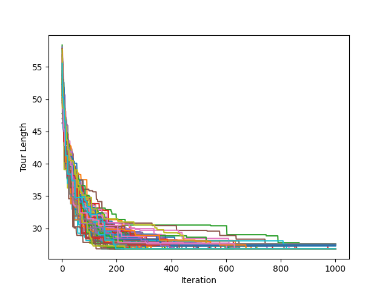
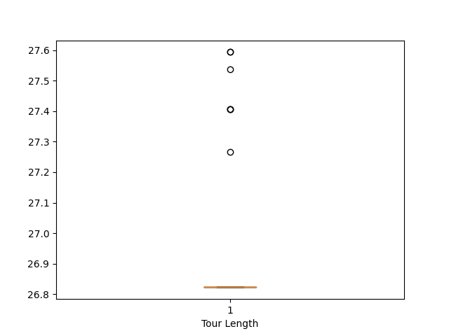
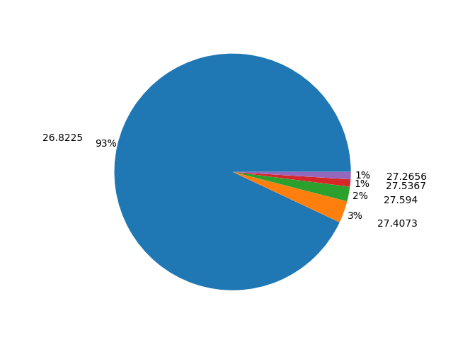
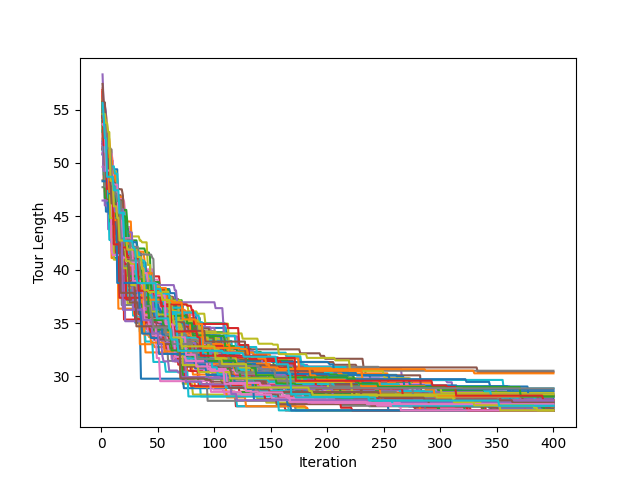
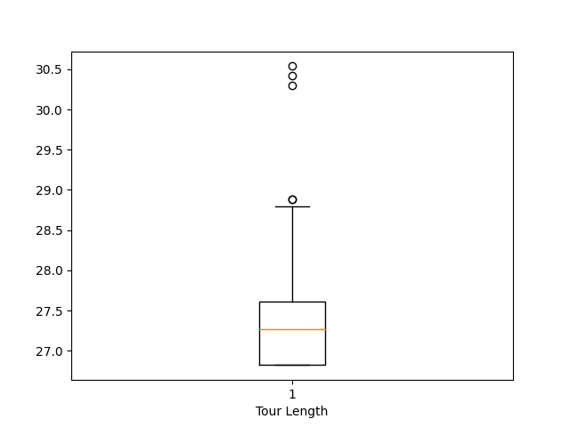
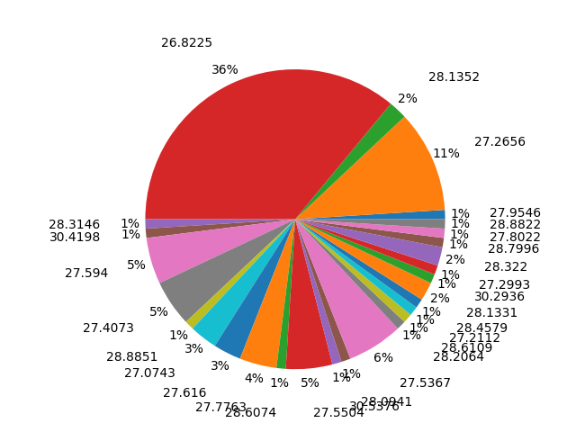

# TSP using Genetic Algorithms
[](https://github.com/MarvinKlemp/TSP/actions)

# Algorithm
After a short literature review most of the publications found are using genetic algorithms in order to solve the traveling salesman problem.

The HeSEA algorithm looked like a promising publication to solve the TSP. Unfortunately the selection didn't perform like expected with only 21 cities (HeSEA is optimized for large TSP).
https://ieeexplore.ieee.org/document/1315755

Therefore I've used another publication describing a more general genetic algorithm to solve the TSP.
(RouletteWheelSelection, Elitism, OrderedCrossover, ReverseSequenceMutation)
https://arxiv.org/abs/1203.3097

# Setup
## How to use
`./tsp <population_size> <elites_size> <iterations>`

The executable runs 100 experiments (Algorithm is run 100 times and reset after each try to get a better statistical understanding). Each experiment the best chromosome is printed to stdout. Also a `genetic_tsp.csv` is generated. The csv rows contain the different experiments the columns contain the best chromosome after iteration i.

Using `./vizualize.py <genetic_tsp.csv>` the results over 100 experiments can be displayed. `vizualize.py` needs `matplotlib` installed and will create `genetic_tsp_curves.png, genetic_tsp_boxplot.png, genetic_tsp_piechart.png`.


## Cmake
The project contains a valid cmake configuration. A c++17 compatible compiler is required to install via cmake.

```
#!/bin/bash
cmake -E make_directory ./build
cd /opt/build
cmake ../ -DCMAKE_VERBOSE_MAKEFILE:BOOL=ON -DCMAKE_BUILD_TYPE=RELEASE
cmake --build . --config RELEASE
```

## Docker
If no c++17 compiler is available the shipped Dockerfile can be used.

This will automatically run 100 experiments with: 
- 1000 chromosomes
- 100 elites
- 1000 iterations

(Change is possible in `docker_run.sh`) 

```
docker build --no-cache -t genetic_tsp:v1 -f Dockerfile ./
docker run -it -w /opt -v $(pwd):/opt genetic_tsp:v1 /opt/docker_run.sh
```

This will generate three overview diagrams in order to get an overview of the results in your working directory. 

# Results
Found Optimum:
`(26.8225) Ismaning,Ingolstadt,Nürnberg,Leinfelden-Echterdingen,St. Georgen,Bretten,Eschborn,Hürth,Düsseldorf,Essen,Münster,Lingen,Schortens,Hamburg,Hannover,Braunschweig,Berlin,Görlitz,Chemnitz,Passau,Ismaning`

or the reverse:

`(26.8225) Ismaning,Passau,Chemnitz,Görlitz,Berlin,Braunschweig,Hannover,Hamburg,Schortens,Lingen,Münster,Essen,Düsseldorf,Hürth,Eschborn,Bretten,St. Georgen,Leinfelden-Echterdingen,Nürnberg,Ingolstadt,Ismaning`

- Population size: 1000
- Iterations: 1000
- Elites: 10% (50)
- Mutation chance: 10%





In most of the experiments after ~600 iterations the global optimum is found. In some experiments even after 1000 iterations the global optimum is not found.
In these cases the algorithm is stuck in a local optimum.

To further confirm this I repeated 100 experiments with only 400 iterations in each experiment.
The images below describe the results. The global optimum is now only in a ~third of all experiments found.





